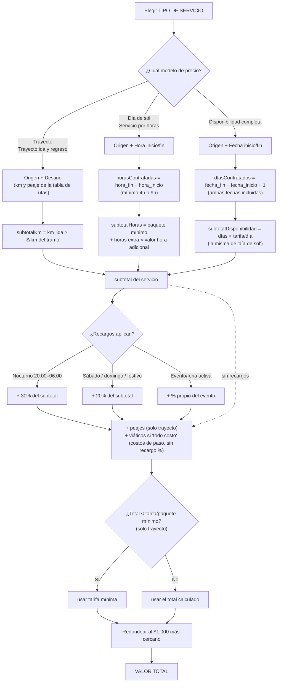

# Lógica del cotizador — RutaClara

Este documento resume **toda** la lógica de precios del cotizador en un solo
lugar, para que sea fácil de revisar y ajustar sin tener que leer el código.
Toda la lógica real vive en `lib/tarifas.ts`, `lib/festivos.ts`,
`lib/eventos.ts` y `lib/direcciones.ts` — este archivo es solo el mapa.

> Si cambias un número aquí, recuerda que también hay que cambiarlo en el
> código (este documento no alimenta la app, es de referencia). La sección
> [8. Dónde editar cada cosa](#8-dónde-editar-cada-cosa) tiene el archivo y
> la constante exacta de cada valor.

---

## 1. Flujo general

Además del precio, el cotizador revisa dos cosas que **no cambian el
valor**, solo avisan:
- **Restricción de zona**: si la dirección escrita cae en una zona conocida
  y la tipología elegida no puede entrar ahí (buses/busetas en centros
  históricos, por ejemplo).
- Todo se muestra como aviso **antes** de cotizar (apenas se llena fecha,
  dirección o tipología), nunca como sorpresa en el resultado final.

---

## 2. Los 5 tipos de servicio

| Tipo | Campos que pide | Modelo de precio | Mínimo | Peajes |
|---|---|---|---|---|
| **Trayecto** | Origen, destino, fecha, hora | `km_ida × $/km del tramo` | Tarifa mínima por tipología | Solo ida |
| **Trayecto ida y regreso** | Origen, destino, fecha, hora | Igual, pero el vehículo vuelve | Tarifa mínima por tipología | Ida y regreso (× 2) |
| **Día de sol** | Origen, fecha, hora inicio/fin | Paquete fijo (9h) + horas extra | 9 horas | No aplica |
| **Servicio por horas** | Origen, fecha, hora inicio/fin | Paquete fijo (4h) + horas extra | 4 horas | No aplica |
| **Disponibilidad completa** | Origen, fecha inicio/fin | Días × tarifa/día (la de "día de sol") | 1 día | No aplica |

Todos aceptan además: dirección exacta (opcional, para restricción de zona)
y la casilla "todo costo" (viáticos del conductor).

---

## 3. Tarifa por kilómetro (Trayecto / Trayecto ida y regreso)

La tarifa es **degresiva**: a mayor distancia, menor $/km. El tramo se
calcula con el **km de ida únicamente** (nunca con el total), y ese mismo
$/km es el que se multiplica por el km de ida para dar el subtotal — el
regreso del vehículo no vuelve a multiplicar el subtotal, solo cambia si se
cobra el peaje una vez o dos.

**Tramos**: `0–50 km` · `50–150 km` · `150–400 km` · `+400 km`

| Tipología | Capacidad | 0–50 km | 50–150 km | 150–400 km | +400 km | Tarifa mínima |
|---|---:|---:|---:|---:|---:|---:|
| Automóvil (4 pax) | 4 | $5.600 | $4.000 | $3.550 | $3.200 | $90.000 |
| Campero 4x4 (5 pax) | 5 | $7.600 | $5.450 | $4.800 | $4.350 | $120.000 |
| Camioneta SW 4x2 (5 pax) | 5 | $7.100 | $5.100 | $4.500 | $4.100 | $110.000 |
| Camioneta doble cabina 4x4 (5 pax) | 5 | $8.600 | $6.200 | $5.450 | $4.950 | $130.000 |
| Van hasta 8 pax | 8 | $8.100 | $5.800 | $5.150 | $4.650 | $130.000 |
| Van hasta 15 pax | 15 | $10.400 | $7.800 | $7.100 | $6.200 | $150.000 |
| Van techo alto hasta 19 pax | 19 | $13.000 | $9.650 | $8.300 | $7.050 | $180.000 |
| Buseta 20-30 pax | 30 | $14.800 | $11.000 | $9.400 | $8.000 | $200.000 |
| Busetón 30-40 pax (sin baño) | 40 | $15.500 | $11.700 | $10.000 | $8.300 | $220.000 |
| Bus 40+ pax (con baño) | 45 | $16.100 | $12.300 | $10.700 | $8.600 | $250.000 |

**Peajes**: el valor base de la tabla de rutas (sección 6) es para vehículo
liviano. Buseta, busetón y bus pagan **×1.8** (más ejes en las casetas).
Ida y regreso duplica el peaje resultante; trayecto sencillo lo cobra una
sola vez.

---

## 4. Tarifa por tiempo (Día de sol / Servicio por horas / Disponibilidad completa)

Cada tipología tiene un **paquete fijo** para el mínimo de horas, y un
**valor de hora adicional** para lo que exceda ese mínimo. "Disponibilidad
completa" reutiliza el paquete de 9h como tarifa por día — no tiene tabla
propia.

| Tipología | Paquete 4h (Por horas) | Paquete 9h (Día de sol / tarifa por día) | Hora adicional |
|---|---:|---:|---:|
| Automóvil | $140.000 | $260.000 | $25.000 |
| Campero | $170.000 | $310.000 | $30.000 |
| Camioneta SW | $160.000 | $290.000 | $28.000 |
| Camioneta doble cabina | $180.000 | $330.000 | $32.000 |
| Van hasta 8 pax | $190.000 | $360.000 | $35.000 |
| Van hasta 15 pax | $230.000 | $450.000 | $45.000 |
| Van techo alto 19 pax | $280.000 | $540.000 | $55.000 |
| Buseta | $340.000 | $650.000 | $65.000 |
| Busetón | $380.000 | $720.000 | $72.000 |
| Bus | $420.000 | $800.000 | $80.000 |

- **Horas contratadas** = `hora_fin − hora_inicio`, redondeado hacia arriba
  (una fracción de hora se cobra como hora completa). Si el resultado es
  menor al mínimo del tipo elegido, se cobra igual el mínimo.
- **Días contratados** (disponibilidad completa) = `fecha_fin − fecha_inicio
  + 1` (ambas fechas incluidas). Ej: 1 al 4 de agosto = 4 días.

---

## 5. Recargos (se acumulan entre sí)

Los tres recargos se calculan **sobre el subtotal del servicio** (nunca
sobre peajes o viáticos, que son costos de paso) y **se suman todos los que
apliquen** — un servicio nocturno, en festivo y en plena feria acumula los
tres a la vez.

| Recargo | Cuándo aplica | % |
|---|---|---:|
| **Nocturno** | Hora de inicio entre 8:00 p.m. y 6:00 a.m. | 30% |
| **Fin de semana / festivo** | Sábado, domingo, o festivo colombiano (calculado, no una lista fija — ver sección 7) | 20% |
| **Evento / temporada alta** | Origen o destino tiene una feria activa esos días (ver sección 8) | Varía por evento (20–30%) |

---

## 6. Rutas y distancias (desde Medellín)

Km de ida y peaje base (vehículo liviano) por sentido. Si el destino no
está en esta tabla, el cotizador pide el km manualmente.

| Destino | Km (ida) | Peaje base |
|---|---:|---:|
| Aeropuerto JMC (Rionegro) | 35 | $18.600 |
| Guatapé | 79 | $18.600 |
| El Peñol | 69 | $18.600 |
| Rionegro | 34 | $18.600 |
| El Retiro | 33 | $18.600 |
| La Ceja | 43 | $18.600 |
| Santa Fe de Antioquia | 57 | $15.800 |
| San Jerónimo | 38 | $15.800 |
| Sopetrán | 49 | $15.800 |
| Jardín | 134 | $12.400 |
| Jericó | 113 | $12.400 |
| Guatapé - Represa | 81 | $18.600 |
| Doradal | 166 | $32.000 |
| Puerto Triunfo | 175 | $32.000 |
| La Pintada | 79 | $12.400 |
| Bogotá | 416 | $96.000 |
| Pereira | 212 | $54.000 |
| Manizales | 195 | $48.000 |
| Cartagena | 643 | $118.000 |
| Coveñas | 502 | $92.000 |
| Tolú | 512 | $92.000 |
| Santa Marta | 716 | $132.000 |
| Barranquilla | 690 | $126.000 |
| Cali | 414 | $88.000 |
| Bucaramanga | 390 | $84.000 |
| Montería | 340 | $62.000 |
| Turbo | 340 | $46.000 |
| Caucasia | 285 | $40.000 |
| Necoclí | 385 | $46.000 |
| Urrao | 159 | $15.800 |

---

## 7. Festivos colombianos

**No es una lista fija por año** — se calcula algorítmicamente, así que
sirve para cualquier fecha sin mantenimiento:

- **6 fijos**: Año Nuevo (ene 1), Día del Trabajo (may 1), Independencia
  (jul 20), Batalla de Boyacá (ago 7), Inmaculada Concepción (dic 8),
  Navidad (dic 25).
- **10 de Ley Emiliani** (se trasladan al lunes siguiente si no caen en
  lunes): Reyes Magos, San José, Ascensión del Señor, Corpus Christi,
  Sagrado Corazón, San Pedro y San Pablo, Asunción de la Virgen, Día de la
  Raza, Todos los Santos, Independencia de Cartagena.
- **2 de Semana Santa** (dependen de la Pascua, no se trasladan): Jueves y
  Viernes Santo.

---

## 8. Eventos / temporada alta (demo)

| Evento | Ciudad | Fechas 2026 | Recargo |
|---|---|---|---:|
| Feria de las Flores | Medellín | 1–9 agosto | 25% |
| Alumbrados navideños | Medellín | 1–31 diciembre | 20% |
| Feria de Cali | Cali | 25–30 diciembre | 25% |
| Carnaval de Barranquilla | Barranquilla | 14–17 febrero | 30% |
| Feria de Manizales | Manizales | 2–11 enero | 25% |

*(Datos ilustrativos — ver sección 9 para dónde editarlos o agregar más.)*

---

## 9. Restricción de acceso por zona (demo)

Solo informativa (no cambia el precio). Coincidencia por palabra clave en
la dirección escrita — no es geolocalización real todavía (ver README.md,
sección "Qué está simulado", para conectar Google Maps más adelante).

| Municipio | Zona | Vehículos restringidos |
|---|---|---|
| Medellín | El Poblado — Parque Lleras / Zona Rosa | Buseta, busetón, bus |
| Medellín | Laureles — Circulares | Busetón, bus |
| Santa Fe de Antioquia | Centro histórico | Buseta, busetón, bus |
| Guatapé | Centro / Malecón | Busetón, bus |
| Jardín | Parque principal | Buseta, busetón, bus |

---

## 10. Viáticos del conductor ("todo costo")

Si se marca la casilla, se suma un valor fijo por día
(**$90.000/día**, hoy igual para todas las tipologías) como costo de paso
— no lleva recargo % de festivo/evento, igual que los peajes. En trayecto,
día de sol y por horas cuenta como 1 día; en disponibilidad completa se
multiplica por el número de días.

---

## 11. Dónde editar cada cosa

| Qué quieres cambiar | Archivo | Constante/función |
|---|---|---|
| $/km por tipología y tramo | `lib/tarifas.ts` | `TARIFAS_KM` |
| Tarifa mínima (trayecto) | `lib/tarifas.ts` | `TARIFA_MINIMA` |
| Paquetes por horas / día de sol | `lib/tarifas.ts` | `TARIFA_POR_HORAS` |
| Horas mínimas (4h / 9h) | `lib/tarifas.ts` | `HORAS_MINIMAS` |
| % recargo nocturno | `lib/tarifas.ts` | `RECARGO_NOCTURNO` |
| % recargo fin de semana/festivo | `lib/tarifas.ts` | `RECARGO_FIN_DE_SEMANA_FESTIVO` |
| Multiplicador de peaje (vehículos grandes) | `lib/tarifas.ts` | `MULTIPLICADOR_PEAJE_VEHICULO_GRANDE` |
| Valor del viático diario | `lib/tarifas.ts` | `VIATICOS_CONDUCTOR_DIA` |
| Rutas, km y peajes | `lib/distancias.ts` | `RUTAS_DESDE_MEDELLIN` |
| Festivos (reglas, no datos) | `lib/festivos.ts` | `obtenerFestivosColombia()` |
| Eventos / temporada alta | `data/eventos.json` | — |
| Zonas con restricción de acceso | `data/zonas-restringidas.json` | — |
| Fórmula completa (cómo se combina todo) | `lib/tarifas.ts` | `calcularCotizacion()` y sus 3 funciones internas (`calcularCotizacionTrayecto`, `calcularCotizacionPorHoras`, `calcularCotizacionDisponibilidad`) |

Todas las funciones en `lib/tarifas.ts` son **puras** (mismo input → mismo
output, sin efectos secundarios), así que cualquier ajuste ahí es seguro de
probar de forma aislada.
